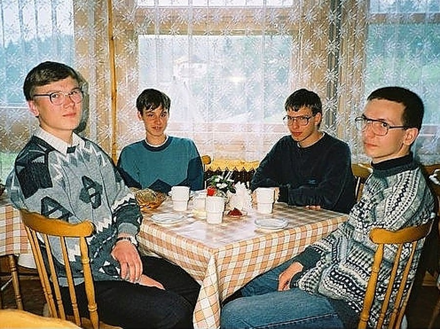
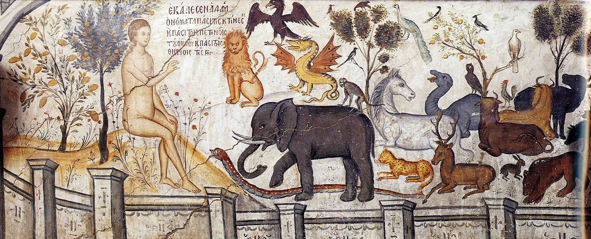
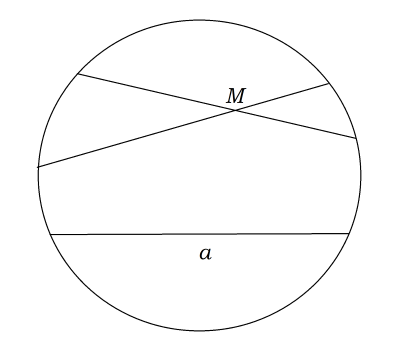

### Федя Носков
## Заголовок
*Посвящается моему учителю по математической логике Евгению Владимировичу Дашкову*

#### Содержание

* [Вступление](#introduction)
* [Касталийский Адам](#adamssheep)
* [Библиография](#bibliography)

#### <a name="introduction">Вступление</a>

В романе Германа Гессе "Игра в бисер" описывается страна, отделенная от всего остального мира, называемая Касталией. Образ этой страны часто возникает в моей голове; но еще чаще мне кажется, что я обнаружил ее в реальности. Я имею в виду свою alma mater, Физтех. Далеко не все его студенты смогут разделить мои ощущения из-за некасталийского образа жизни, из-за царящей вокруг них атмосферы угара, отчаянного и лишенного рамок веселья. Или просто атмосферы отчаяния. Не отрицаю, что и сам погружен в этот дурман и дым, но сквозь чад кутежа все-таки проглядывают силуэты гессианского невиданного государства. Именно их я хочу поймать и поместить на страницы моей повести, причем сразу в двух ипостасях: в виде кратких заметок о родном вузе и в виде своеобразной математической Аркадии, на примере которой столь ясно предстали передо мной многие понятия логики.

*Классический мем "Crazy IT party"*

Вообще, математическая логика --- предмет совершенно особый. Удивительным образом он оказался на границе философии, математики и лингвистики. Наука знает много споров, но не многие сравнятся с тем, что происходило в математике на рубеже XIX и XX веков. Вопросы, заданные едва ли не Платоном, внезапно стали актуальными, породили вокруг себя дискуссии, дебаты. Ученые издевались друг на другом в статьях; воевали за места в университетах; перекрывали друг другу доступ к научной публикации; сходили с ума в конце концов.

Подстать науке и ее преподаватели. Математическую логику на моем потоке вел Евгений Валерьевич Александров. Это один из лучших педагогов,  что я видел в жизни. На Физтехе ходить на лекции не принято, особенно после того, как руководство вуза запретило лекторам фиксировать посещаемость; но когда матан посещали всего человек пять-шесть, Евгений Валерьевич мог похвалится двадцатью человеками на лекции (что, кстати, все равно четверть от всего потока, но все-таки близко к рекорду). И не с проста: матлог казался нам порождением фантазии наркомана; даже в локальном паблике с мемами не иссякали шутки про марихуану и косяки, и Евгений Валерьевич не стремился эту репутацию своего предмета опровергнуть. Во время лекции он много ходил, подпрыгивал, присаживался; часто повышал голос до крика, увлекаясь какой-то теоремой. Но интересно было смотреть не за этим --- гораздо более причудливые вещи излагались на доске. Все это, а еще причудливые шутки, необычные отсылки то к Библии (скорее даже ко всей мировой литературе), то к алхимии и вообще к Средневековью, превращало лекцию в сольный концерт, атмосферу которого я надеюсь в этой книге передать.

Лучше всего ее читать, включив на фоне Баха или Букстехуде. Нет предмета, который бы в большей степени соответствовал духу барокко, столь горячо любимого Евгением Валерьевич Александровым, а нынче и мною.

#### <a name="adamssheep">Касталийский Адам</a>

Наверняка, пока вы были ребенком, бабушка или дедушка, а может, мама или папа рассказывали вам об Адаме и Еве и их изгнании из Эдема; или, быть может, ваша семья была неверующей, но точно что-нибудь вы могли слышать в школе. Я сам помню, как где-то в начальных классах к нам на Пасху во время урока вошла библиотекарь и келейным голоском начала повествование о распятии Иисуса со множеством апокрифических подробностей. Рассказ этот был сбивчивый и временами очень странный: несмотря на свое воспитание в христианской общине я едва ли улавливал знакомые мотивы. Также и мама, человек, давно уже воцерковленный и знающий Новый Завет фактически наизусть, не успевала удивляться новым подробностям Воскресения, когда слушала за ужином мой ежедневный рассказ о школе в тот день.

Теперь мне кажется, что та библиотекарь хотела поведать свои мысли, сложив их с текстом Священного Писания. И, что удивительно, этот подход не бесплоден, и нынче мне хочется сделать то же.

Вернемся к теме Адама и Евы. Если вы помните, там было так:

>  Господь Бог образовал из земли всех животных полевых и всех птиц небесных, и привел [их] к человеку, чтобы видеть, как он назовет их, и чтобы, как наречет человек всякую душу живую, так и было имя ей. И нарек человек имена всем скотам и птицам небесным и всем зверям полевым; но для человека не нашлось помощника, подобного ему.
>
> *Бытие, глава 2, стихи 19-20*

Мой Адам жил совершенно иначе. Боги Касталии прежде всех зверей и птиц создали человека, положим математика. На свет о появился абсолютно голым, и хоть не устыдился своей наготы, но начал мерзнуть и попросил у богов одежды. Возмущенные боги сказали ему: "Адам, мы в поте лица трудились, создавая тебя и мир вокруг! И что же мы слышим вместо благодарности? Жалобу! Знаешь ли, ты всего лишь мерзнешь, а в Африке дети голодают!" Но Адаму все равно было холодно: "Боги, хорошо. Но скажите, для того ли вы создали меня единственным живым существом, чтобы я был венцом этого мира? И не достоин ли я как венец одежды?" Боги посовещались и ответили Адаму: "Нет, ты венцом не будишь. Мы создадим еще одно живое существо. Как ты, Адам, желаешь его видеть?" Хитроумный Адам сказал: "Хочу, чтобы у него была длинная шерсть, четыре ноги, и оно бы издавало очень милые звуки". Боги посовещались и создали из земли козу. Адам воскликнул: "Иди сюда! Я острегу тебя и совью себе одежду! Отныне, венец творенья, я буду звать тебя овцой".

Мораль этой истории, больше похожей на чепуху, очень проста. Адам не знает, как выглядит овца. Но ему известно, что у овцы есть шерсть. Далее он делает вывод, что из шерсти можно связать одежду. А на то, что его овца выглядит как коза, ему плевать. Поразительнее всего, что такой подход не чужд всем математикам. Проиллюстрирую это.

Когда математик рассуждает о теории он имеет в виду две вещи: обозначения этой теории и ее аксиомы. Под обозначениями я имею в виду, к примеру, знак "$+$". Про него известно, что он --- функция, которая принимает два аргумента и возвращает какую-то однородною с этими двумя аргументами величину. Сложим вместе два числа --- получим число. Сложим вместе две строки --- получим строку. Остальные свойства этого знака регулируются аксиомами. К примеру, утверждение $a + b = b + a$ называется коммутативностью. Это одна из аксиом теории действительных чисел. А вот при сложении строк это свойство не выполняется: строка $bar + foo = barfoo$ не равна $foo + bar = foobar$.

Лучше подробнее рассмотреть, что такое аксиома. Едва ли у вас не было геометрии в школе. Там вы брали какие-то уже готовые утверждения и получали из них новые. Логично предположить, что существуют какие-нибудь базовые утверждения, какие-то кирпичики, из которых строится вся последующая теория.

Многие знают такое утверждение из геометрии:

> Через всякую точку, не лежащую на данной прямой, проходит прямая, параллельная данной, причем только одна.

Разумеется, это так называемый пятый постулат Евклида, уже давно ставший достоянием широких масс! Но поскольку Евклид достаточно строгой теории планиметрии не построил, я скажу, что это одна из аксиом планиметрии Фридрих а Шура и сойду за умного человека.

Итак, все знают, что если поменять в теории аксиому параллельности на утверждение

>Через точку, не лежащую на данной прямой, проходят по крайней мере две прямые, лежащие с данной прямой в одной плоскости и не пересекающие её.

то получится геометрия Лобачевского.

Далее у любого человека должно возникнуть желание это представить. И тут уместно поговорить, что такое прямая. Сначала в начальной школе нам говорят, что прямая --- это неопределяемое понятие. После заявляют, что прямая --- это множество решений уравнения $a x + b y + c = 0$, где $a$ и $b$ не равны нулю одновременно. Кому здесь верить?

Дело в том, что кроме самой теории существует ее модель. Именно на этапе выбора модели мы назначаем, что у нас будет прямыми, точками и плоскостями. Т.е. если вся наша теория состоит в том, что животное с шерстью можно побрить, то неважно, кто будет животным, что будет шерстью и как все это брить. Главное здесь одно: если теория непротиворечива, то у нее есть модель (овца в нашем случае).

Феликс Клейн предложил такую модель геометрии Лобачевского: зафиксируем какой-нибудь круг на плоскости (скажем, $x^2 + y^2 < 1$); "точками", которые были неопределяемым понятием, будем называть внутренние точки этого круга, сама же внутренняя плоскость будет нашей "плоскостью". А прямыми мы будем называть отрезки, соединяющие точки на границе круга, сиречь хорды. Вы не поверите, но наша геометрия готова: через любую точку, не лежащую на данной прямой проходит по крайней мере две прямые, не пересекающие данную!

*Через точку M действительно проходит две прямые, параллельные a*

Конечно, пугает, что прямые, которые всю нашу жизнь были бесконечными, внезапно уместились в отрезки. Но, во-первых, в аксиомах Шура о бесконечности прямых не говорится, а во-вторых, можно было бы ввести расстояние между точками (в котором та самая бесконечность и прячется), которое бы сохранялось при различных движениях плоскости. Но тогда надо было бы говорить о проективной геометрии и о том, что такое движение. Из любопытства смотрите [эту книгу](#Shafarevich). Моя же основная цель объяснить, что такое модель.

#### <a name="bibliography">Библиография</a>
1. <a name="Shafarevich">Шафаревич И. Р., Ремизов А. О. Линейная алгебра и геометрия</a>
